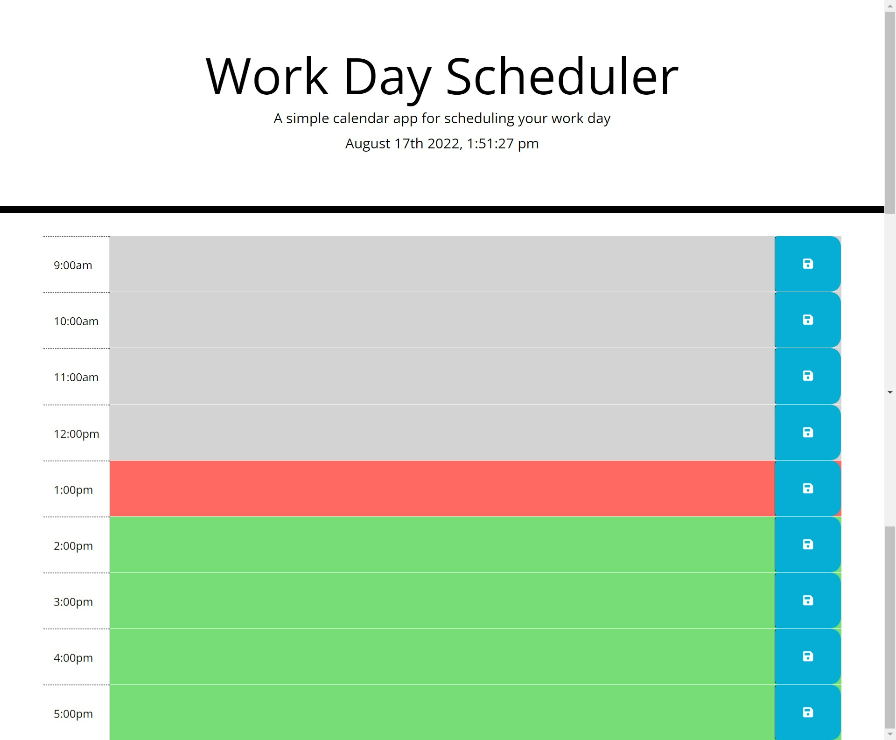

# Work Day Scheduler Starter Code

## Purpose
Create a calendar to schedule events during business hours. The times are color coded to let you know wether the time is in the past, present, or future.

## Created using
JavaScript
HTML
CSS

## Screen Shot
